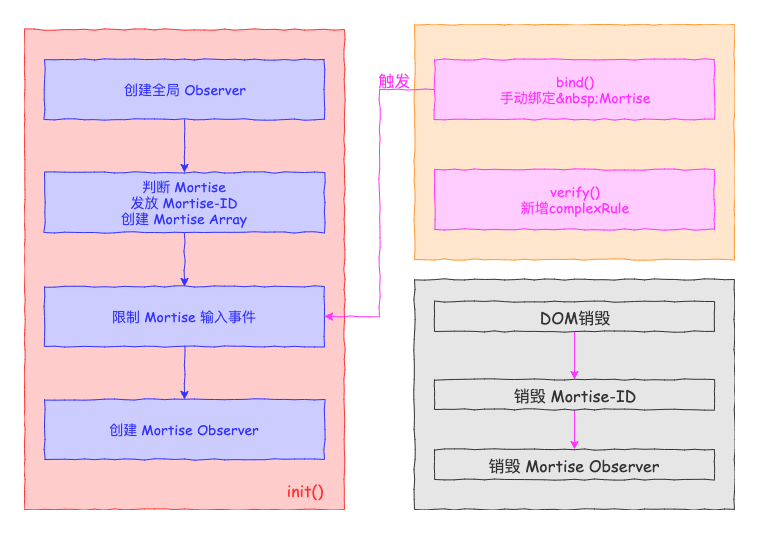

# mortise

通过 mortise 来设置 input 输入限制

## 使用方法

下载 mortise.js
在 html 中引入 js
在需要使用的 input 添加`mortise`属性
例如：
```html
  <script src="../mortise.js"></script>
  <script>
    Mortise.init();// 初始化 Mortise
    Mortise.bind('#str', 'number'); // 动态绑定 Mortise
    Mortise.verify({
        'idCard': (element)=>{
          // console.log(element);
          console.log(element.value);
          
          if(element.value.lenght <= 17){
            element.value = element.value.replace(/[^0-9]/g, '');
          }
          else{
            element.value = element.value.replace(/[^0-9X]/g, '');
          }
          element.value = element.value.slice(0,18);
        }
      }); // 动态创建 Mortise 限制条件
  </script>
```
在需要限制的input元素增加mortise属性例如
```html
  <input type='text' mortise='number'/>
  <!-- mortise 属性建议小写 如果包含大写字母 会转化成小写再匹配 -->
```
> 可以使用bind函数在js中动态绑定
> 参数一 可以是选择器 也可以是dom 对象
> 参数二 是绑定的内容

## mortise

- number 数字
- char 字母
- capital 大写字母
- lowercase 小写字母

## tips

部分内容还没有开发完成
demo 文件在 test 目录下
